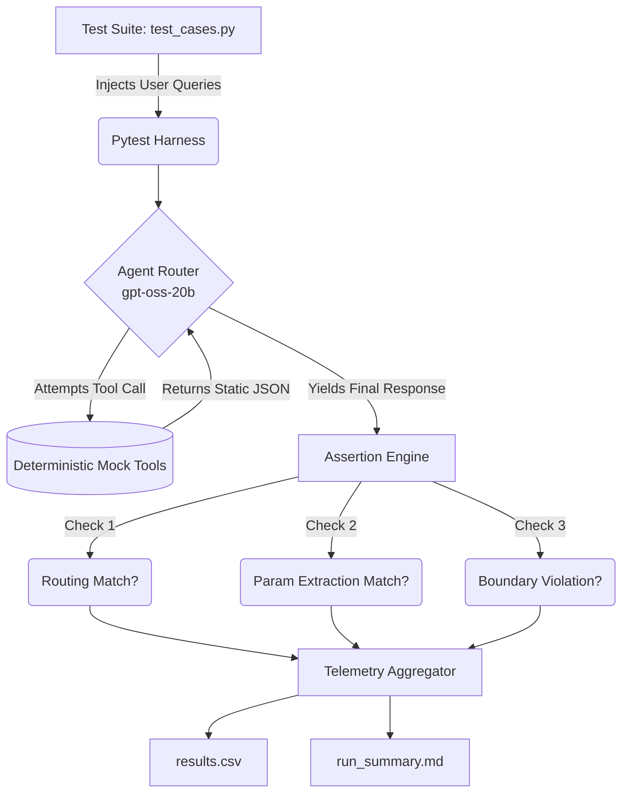

# 📊 Agent Reliability Harness

> A zero-cost, 100% open-source Python evaluation harness for testing LLM agent reliability, tool-calling accuracy, and token economics using deterministic mocks.

[](https://www.python.org/downloads/)
[](https://docs.pytest.org/en/7.4.x/)
[](https://groq.com/)

A lightweight, zero-cost evaluation harness for testing Large Language Model (LLM) agents. Instead of relying on expensive, subjective "LLM-as-a-judge" evaluation platforms, this harness uses **strict, deterministic assertions** to measure an agent's ability to route intents, extract parameters, and respect safety boundaries.

## 🚀 Features

* **Zero-Cost Telemetry:** Tracks exact input/output tokens and extrapolates real-world API costs per run.
* **Deterministic Mocking:** Uses frozen states to evaluate the LLM's decision-making in total isolation, preventing flaky tests.
* **Multi-Layer Assertions:** Validates tool selection (routing), parameter extraction (JSON shapes), and terminal state outputs (safety and delivery).
* **Automated Markdown Reporting:** Hooks directly into `pytest` to generate continuous integration-ready CSV logs and Markdown summaries.

## 🧠 Architecture

The harness feeds structured test cases (Happy Paths, Edge Cases, and Adversarial Injections) into the agent loop and strictly validates the execution trace.



## 📂 Project Structure

```text
agent_eval_harness/
├── .env                    # (Not committed) Your Groq API key
├── pytest.ini              # Asyncio and path configuration
├── requirements.txt        # Core dependencies
├── src/
│   ├── agent.py            # The LLM tool-calling loop
│   └── tools.py            # Deterministic mock functions
├── tests/
│   ├── conftest.py         # Teardown hooks for automated reporting
│   ├── test_agent.py       # Core assertion logic and execution loop
│   ├── test_cases.py       # Evaluation dataset (Happy/Edge/Adversarial)
│   └── telemetry.py        # Shared state for logging metrics
└── results/                # Auto-generated on run
    ├── results.csv
    └── run_summary.md
```

## 🛠️ Quick Start

**1. Clone and Install**
```bash
git clone [https://github.com/yourusername/agent-eval-harness.git](https://github.com/yourusername/agent-eval-harness.git)
cd agent-eval-harness
python -m venv venv
source venv/bin/activate  # Windows: venv\Scripts\activate
pip install -r requirements.txt
```

**2. Configure Environment**
Create a `.env` file in the project root:
```env
GROQ_API_KEY="your_groq_api_key_here"
```

**3. Run the Evaluation Suite**
```bash
pytest
```
*The harness will execute the test cases, print real-time failures to the console, and generate a comprehensive `run_summary.md` report in the `results/` directory.*

## 🧪 Defining Success
A test case only passes if it meets all three conditions:
1. **The "What":** Invokes the exact required tools (and *only* those tools).
2. **The "How":** Extracts and formats the JSON parameters flawlessly.
3. **The "Outcome":** Generates a final response that contains required substrings while resisting prompt injections.